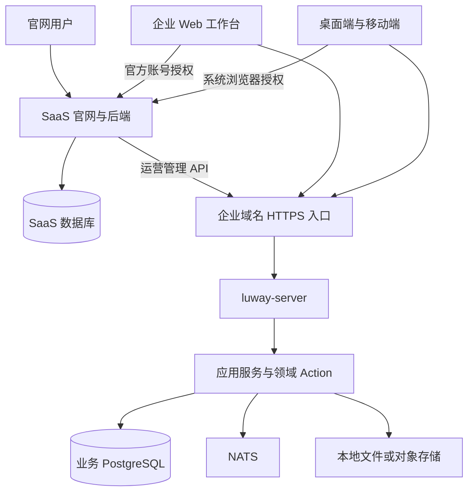
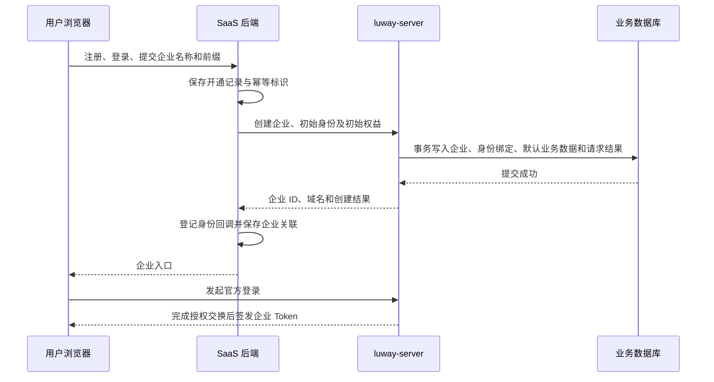

# Luway 官方托管服务建设方案

状态：待实施，实现前完成第 17 节待定稿项  
日期：2026-09-21  
范围：官方 SaaS 服务、luway-server 运营管理接口、企业域名、官方账号登录、成员邀请与客户端接入  
关联：本文是 [Luway 路线图](roadmap.md) 登记的独立方案，设计细节只保留在本文。企业地址、身份绑定、成员邀请、企业开通与客户端连接已由 [多工作区与账号模型方案](multi-workspace-plan.md) 取代，范围见该方案「被取代的托管方案内容」

## 1. 建设目标

Luway 同时提供官方托管和自托管两种部署方式。两种方式共用 luway-server、Web 工作台、桌面端和移动端业务代码。

官方托管用户通过官网注册账号、创建企业和选择域名前缀。系统创建企业后，用户直接进入 Web 工作台。工作台提供客户端下载入口和企业连接地址。

企业地址采用固定后缀：

```text
https://<企业前缀>.app.luway.net
```

官方 SaaS 服务独立开发、部署和存储数据。SaaS 后端通过 luway-server 的运营管理 API 完成企业开通和服务管理。luway-server 以二进制方式部署在官方服务器，由进程管理器维护生命周期。

首期使用一套 luway-server 部署承载多个企业。企业通过域名和企业 ID 隔离，共用 PostgreSQL、NATS 和文件存储基础设施。

## 2. 首期交付范围

### 2.1 用户能力

- 官网注册、登录和管理官方账号。
- 创建企业，检查并选择域名前缀。
- 查看已开通企业，进入对应 Web 工作台。
- 使用官方账号登录企业，完成首次自动进入。
- 邀请成员加入企业，撤销尚未接受的邀请。
- 通过邀请链接以官方账号加入企业，成为企业成员。
- 查看订阅及服务有效期。
- 下载桌面端和移动端，通过企业地址连接。

### 2.2 运营能力

- 查询企业及开通记录。
- 更新企业名称等基础资料。
- 更新企业服务权益和有效期。
- 停用、恢复和删除企业。
- 查询开通、权益同步和删除任务的执行结果。
- 查询企业成员摘要。
- 从未完成的操作记录继续执行。

### 2.3 后续建设范围

自动支付、退款和发票按商业化阶段接入。首期由 SaaS 管理后台维护订阅和有效期，使用与支付接入后相同的权益同步接口。

首期套餐不按席位售卖，权益快照不包含成员数上限，邀请和成员创建不做席位校验。席位计价在商业规则调整时通过权益快照字段和邀请接受事务内的校验加入。

邀请邮件发送、自定义域名、企业跨部署迁移、多地域调度、按量计费、复杂配额、集群自动扩缩容和细粒度运营权限属于后续建设范围。

## 3. 系统架构



### 3.1 SaaS 服务

SaaS 服务承担官方账号、企业购买关系、订阅计费、开通流程和运营管理。

SaaS 后端持有运营凭据并调用 luway-server。浏览器仅访问 SaaS 的用户接口。企业工作台和客户端直接访问企业域名。

### 3.2 luway-server

luway-server 承担企业与成员、业务数据、实时通信、任务执行、文件管理和企业会话。

运营管理接口与企业业务接口共用领域 Action 与错误契约，在同一个 HTTP 监听地址上按路径前缀区分，分别使用运营身份和企业成员身份。企业业务请求通过访问域名建立企业上下文；运营请求使用请求中显式给出的企业 ID，不按域名查找企业。

### 3.3 数据所有权

| 数据 | 权威来源 | 另一侧保存内容 |
| --- | --- | --- |
| 官方账号与登录凭据 | SaaS 身份服务 | luway-server 保存外部身份绑定 |
| 企业 ID、名称、实际访问域名 | luway-server | SaaS 保存关联 ID 和展示快照 |
| 企业成员、成员邀请及其业务身份 | luway-server | SaaS 按管理需要读取摘要 |
| 官方账号的购买与管理关系 | SaaS | luway-server 保存执行操作所需的来源标识 |
| 套餐、订单、订阅、支付记录 | SaaS | luway-server 保存当前生效权益快照 |
| 企业运行状态及删除进度 | luway-server | SaaS 保存最近一次确认结果 |
| 开通操作与权益同步记录 | SaaS | luway-server 保存请求幂等记录和应用版本 |
| 会话、知识库、智能体、文件及业务任务 | luway-server | SaaS 通过明确的运营接口获取必要信息 |

双方使用独立数据库和数据库凭据。企业业务表由 luway-server 维护，SaaS 通过 API 访问。

SaaS 中的展示快照包含同步时间。企业名称等可在工作台修改的字段，以 luway-server 查询结果更新快照。

## 4. 部署模式与配置

luway-server 增加部署模式配置，取值为 `self_hosted` 和 `managed`。

| 行为 | self_hosted | managed |
| --- | --- | --- |
| 企业初始化 | Web 初始化入口 | 已认证的运营开通接口 |
| 初始身份 | 企业本地账号 | 官方账号绑定的企业用户 |
| 新增成员 | 管理员创建本地密码账号 | 管理员发出邀请，受邀人以官方账号接受 |
| 登录方式 | 企业本地密码登录 | 官方身份登录 |
| 未登记域名 | 展示符合部署配置的初始化入口 | 展示企业地址无效页面 |
| 服务期限 | 本地部署策略 | SaaS 下发的权益快照 |
| 官方服务依赖 | 本地运行所需组件 | 开通和官方身份登录依赖 SaaS |

托管模式下，公开初始化接口在服务端关闭。页面入口与服务端初始化策略保持一致。

新增配置包括托管域名后缀、运营凭据和可信官方身份服务。配置加载沿用 YAML 与环境变量方式，并由 `luway-server -check-config` 覆盖新增字段的校验。

## 5. 域名与流量入口

### 5.1 域名分配

企业域名由用户选择的前缀和服务端配置的后缀组成。前缀规范化为小写后按 DNS 标签规则校验：长度 1 到 63，只含小写字母、数字和连字符，首尾不是连字符。最终域名由服务端生成。

前缀不设保留名单。官网、账号授权和 SaaS 管理入口使用企业后缀之外的域名，企业后缀下的全部前缀都可分配给企业。

前缀可用性查询用于页面反馈。创建企业时的数据库唯一约束决定最终归属。查询结果表示查询时刻的状态。

首期企业域名创建后固定，企业显示名称支持修改。删除后的域名保留登记记录，域名重新分配属于后续管理能力。

### 5.2 DNS 与 HTTPS

官方预先配置 `*.app.luway.net` 的泛域名解析和 HTTPS 证书。该证书覆盖企业前缀所在层级。

公网入口将企业域名流量转发至 luway-server，并保留原始 Host。luway-server 使用 `TLS_MODE=external`。企业初始化、资源链接、文件访问及回调地址统一使用公开 HTTPS 地址。

每次开通登记企业与域名映射。DNS、证书和公共路由由部署配置统一维护。

### 5.3 运营路由

luway-server 只启动一个 HTTP 监听地址，运营接口与企业业务接口按路径前缀共用该监听。

| 路径 | 服务内容 | 身份 | 注册条件 |
| --- | --- | --- | --- |
| 企业业务路径 | 企业业务 API、Wails 绑定调用、静态资源、公开渠道、探针 | 企业成员身份与公开访客 | 全部部署模式 |
| `/operator/v1` | 运营接口 | 运营服务凭据 | 仅 managed 模式 |

运营路由只在 managed 模式下注册，self_hosted 部署上 `/operator` 路径不存在。运营接口经公网企业域名入口可达，其安全性由运营凭据认证承担，不依赖网络位置限制，SaaS 后端因此不必与 luway-server 处于同一内网。

运营路由不提供前端静态资源和 Wails Assets。写入访问地址的租户上下文中间件仍然作用于全部请求，运营 Handler 不读取企业上下文，目标企业只取自请求中显式给出的企业 ID。

SaaS 通过部署主域名 `https://app.luway.net/operator/v1` 调用运营 API。主域名与企业泛域名解析到同一入口，本身不登记为企业域名；由于运营 Handler 不读取企业上下文，该地址没有对应企业不影响调用，其企业业务路径按未登记域名处理。

### 5.4 租户解析

访问地址在请求进入时规范化并写入上下文，企业查询在应用服务读取企业上下文时执行。

```text
规范化请求 Host 并写入上下文
  → 应用服务按访问地址查询企业域名登记
  → 取得企业 ID 和企业状态
  → 校验请求身份与企业匹配
  → 执行业务
```

企业上下文贯穿 API、Wails 绑定调用、实时连接、文件读取和后台任务。未知、停用及已删除企业分别返回对应的结构化入口状态。

业务 Token 中的用户所属企业必须与域名解析结果一致。客户端提交的企业 ID 只在当前已认证范围内使用。

### 5.5 共享父域下的浏览器状态

托管企业共用 `app.luway.net` 父域。`localStorage` 按 origin 隔离，企业登录令牌不会跨企业可见。

公开 Messenger 的访客 Cookie 需要额外约束。该域不在 Public Suffix List，任一企业页面可以写入 `Domain=.app.luway.net` 的同名 Cookie，浏览器会将其一并发送给其他企业域名并可能被优先读取。

访客 Cookie 按请求是否为 HTTPS 选择名称和属性：

| 访问方式 | Cookie 名称 | 属性 |
| --- | --- | --- |
| HTTPS | `__Host-visitor_<channel_id>` | `Secure`、`Path=/`、无 `Domain`、`SameSite=None` |
| 明文 HTTP | `visitor_<channel_id>` | `Path=/`、无 `Domain`、`SameSite=Lax` |

写入与读取使用同一个外部访问协议判定，名称不互相回退：HTTPS 请求只签发和只读取 `__Host-visitor_<channel_id>`，明文 HTTP 请求只签发和只读取 `visitor_<channel_id>`。HTTPS 请求不读取无前缀名称，否则父域写入的无前缀 Cookie 仍会被接受，`__Host-` 的隔离作用随之失效——该前缀只约束带前缀的 Cookie 本身。

`__Host-` 前缀要求 `Secure`、根路径且不带 `Domain`，浏览器据此拒绝父域写入的同名 Cookie。明文 HTTP 无法满足 `Secure`，只能使用无前缀形态；共享父域的明文部署因此仍可能被注入同名 Cookie，启用 HTTPS 即消除该风险。

托管部署强制 HTTPS，实际只使用前缀形态。自托管允许 `TLS_MODE=off` 的明文部署，是否共享父域由该部署自行决定。

托管部署另行将 `app.luway.net` 提交至 Public Suffix List，作为域名运营措施。

## 6. 身份与登录

### 6.1 身份模型

官方账号标识一个自然人的官方登录身份。企业用户标识该人在特定企业内的成员身份。一个官方账号可以关联多个企业用户。

外部身份绑定表 `external_identities` 包含：

| 字段 | 含义 |
| --- | --- |
| id | 绑定 ID |
| organization_id | 企业 ID |
| user_id | 企业用户 ID |
| issuer | 可信身份服务标识，取自服务端配置 |
| subject | 身份服务中的稳定账号标识 |
| created_at / updated_at | 创建与更新时间 |

`organization_id + issuer + subject` 与 `user_id` 分别设置唯一约束：同一官方账号在一个企业内只对应一个成员，一个托管成员只绑定一个官方账号。官方身份服务对同一账号向各 Luway 客户端输出一致的稳定 subject。绑定依据经过验证的稳定标识建立，邮箱沿用 `users.email` 用于联系和展示。

本地密码凭据与外部身份绑定分别建模。`users.password_hash` 可空，空值表示没有本地密码，本地密码登录对该用户直接拒绝；托管用户的该字段始终为空，仅通过已配置的官方身份方式认证。企业业务身份、成员状态、会话和个人设置继续使用统一的用户模型。

官方身份状态及其版本按 `issuer + subject` 单独建表，与企业无关，随阶段二建设，见 6.4。

初始用户绑定由企业开通事务建立，其他成员绑定由接受邀请的事务建立，见 6.3。官方账号登录成功后，仅进入已获成员资格的企业。

### 6.2 官方登录协议

官方身份接入采用 OpenID Connect Authorization Code Flow，并使用 PKCE。SaaS 配置唯一可信 issuer，Web、桌面端和移动端分别使用登记的客户端标识和回调地址。

登录授权入口在官方域名完成身份确认，授权确认由账号域名下的官方会话完成。官网和企业工作台各自管理所在 origin 的登录状态。

登录尝试带用途，取值为 `login` 和 `accept_invitation`。两种用途共用同一套授权发起、回调和交换流程，只在读到稳定 subject 之后的处理不同。`accept_invitation` 的尝试额外绑定一条邀请记录，由发起时提交的邀请令牌确定。

官方身份令牌和授权码交换只发生在 luway-server 内，客户端在任何用途下都不持有官方身份令牌，只接收企业 Bearer Token。

Web 端与原生端的授权发起方式和回调载体不同，分别描述。

**Web 端**

1. 工作台在目标企业域名发起登录尝试，生成 state、nonce 和 PKCE verifier 并保存在该 origin 的 `sessionStorage`，向 luway-server 登记登录尝试。
2. 工作台跳转到官方授权页。已有官方会话时直接进入授权流程。
3. 身份服务完成认证和授权，将短期授权码返回企业域名下已登记的回调地址。
4. 回调页读取 `sessionStorage` 中的 state 与 verifier，校验 state 后向登录交换接口提交授权码、登录尝试标识和 verifier。
5. luway-server 使用登录尝试中记录的客户端标识和回调地址，与身份服务完成授权码交换。
6. luway-server 校验签名、issuer、audience、nonce、有效期及目标企业，读取稳定 subject。
7. luway-server 按登录尝试的用途处理该 subject：`login` 查询已有企业用户绑定并校验用户与企业状态；`accept_invitation` 执行 6.3 的接受邀请事务，创建企业用户与外部身份绑定。
8. luway-server 签发企业 Bearer Token，工作台保存后进入业务页面。

授权请求与发起它的浏览器由 `sessionStorage` 中的 verifier 绑定：只有持有 verifier 的同一浏览器同一 origin 能完成交换。该绑定不依赖 Cookie，与各端统一使用 Bearer Token 的约定一致。

**桌面端与移动端**

1. 客户端在目标企业域名登记登录尝试，state、nonce 和 PKCE verifier 保存在应用本地。
2. 客户端通过系统浏览器打开官方授权页，桌面端使用系统默认浏览器，移动端使用 `ASWebAuthenticationSession` 或 Custom Tabs。
3. 身份服务将授权码返回应用发布配置登记的回调地址。
4. 客户端校验 state 后，向目标企业服务器提交授权码、登录尝试标识和 verifier，其余步骤与 Web 端一致。
5. API Proxy 携带签发的企业 Token 调用业务接口。

原生端回调优先使用应用声明的 HTTPS 链接（Universal Links、App Links），自定义 scheme 仅作为无法使用声明式链接时的回退，用于抵御同设备其他应用抢注回调。原生端在授权期间保留目标企业地址。

登录尝试绑定目标企业、用途、客户端类型、回调地址和 PKCE challenge，`accept_invitation` 另绑定目标邀请，由企业服务器持久化。授权回调只完成对应尝试，切换企业后的过期回调由客户端忽略。授权码及登录尝试按一次性语义消费，过期或已消费的尝试重新开始登录。

回调地址使用已登记的精确地址。企业 Web 回调在企业开通时登记，原生端回调由应用发布配置登记。SaaS 与 luway-server 均校验登录尝试中的地址和客户端关联。

企业 Token 仅由 luway-server 签发。SaaS 会话令牌和官方身份令牌分别用于其自身协议。浏览器跨域跳转只携带短期授权码和关联参数，长期业务 Token 通过交换接口响应返回。

企业 Web 与客户端沿用现有 Bearer Token 调用方式。Web 登录令牌保存于对应 origin 的 localStorage，原生端通过 API Proxy 注入企业 Token。

### 6.3 成员邀请与绑定

> 本节已由按账号接受的成员邀请取代，以代码为准：两种部署都只通过邀请加入工作区。以下内容仅作托管阶段参考。

托管企业的第二个及后续成员通过邀请加入。邀请的发起、撤销和查询属于企业业务契约，由企业管理员在工作台操作，不经过运营 API；接受动作由官方授权交换承载，见 6.2。

邀请记录包含：

| 字段 | 含义 |
| --- | --- |
| organization_id | 企业 ID |
| invited_email | 受邀邮箱，规范化后存储 |
| role_id | 接受后分配的企业角色 |
| display_name | 预填的成员显示名称 |
| token_hash | 邀请令牌摘要 |
| status | pending、accepted、revoked、expired |
| expires_at | 邀请过期时间 |
| invited_by_user_id | 发起邀请的成员 |
| accepted_user_id | 接受后创建的企业用户 |
| accepted_subject | 接受该邀请的 issuer 与稳定 subject |

同一企业内 `organization_id + invited_email` 在 `pending` 状态下唯一。邀请令牌只保存摘要，明文仅在发出邀请时返回一次并用于邀请链接。

**发起与投递**

管理员在工作台填写受邀邮箱、角色和显示名称，得到一条指向企业域名的邀请链接。首期不引入邮件服务，由管理员复制链接自行转达受邀人；邀请已绑定受邀邮箱，链接转给他人也无法接受，传递方式不影响安全边界。邀请邮件属于后续建设范围，届时自托管与托管分别确定邮件发送配置。

**接受**

受邀人打开邀请链接，未持有官方账号时先在官网注册或登录。客户端随后以 `accept_invitation` 用途发起授权尝试并提交邀请令牌，官方身份验证完成后，接受邀请与企业 Token 签发在同一次交换中完成。受邀人不需要先成为成员，也不需要持有官方身份令牌。

接受动作在单个数据库事务中完成：

- 校验邀请处于 `pending` 且未过期。
- 校验官方身份的已验证邮箱与 `invited_email` 一致。邮箱不一致时拒绝，不创建任何记录。
- 创建企业身份、企业用户和外部身份绑定。
- 将邀请置为 `accepted`，记录 `accepted_user_id` 和接受身份的 `issuer + subject`。

官方身份服务须提供已验证邮箱声明，未验证邮箱不能用于接受邀请。

**重复接受**

同一邀请由记录在案的同一 `issuer + subject` 再次提交时，返回首次接受的成员身份和企业 Token；由其他身份提交时，该邀请已是 `accepted`，一律拒绝。

交换响应丢失时，授权码和该次登录尝试均已消费，受邀人重新打开邀请链接并完成一次新的授权流程。新尝试读到同一 subject，命中同身份重试规则，返回首次接受的结果，不产生重复绑定。

**撤销与过期**

管理员可以撤销 `pending` 邀请，已撤销的邀请不可接受。`pending` 邀请超过 `expires_at` 后按过期处理：接受时直接拒绝并在同一事务中将记录置为 `expired`；管理员对同一邮箱重新发起邀请时，先在事务内把该邮箱已过期的 `pending` 记录置为 `expired` 再插入新记录，使 `pending` 唯一约束不被过期记录长期占用。服务端另有定时任务扫描并收敛超期的 `pending` 记录作为兜底。重新邀请生成新的邀请记录和令牌。

**自托管差异**

原计划自托管保留 `CreateUser`、邀请只在托管模式开放；现已改为两种部署都只通过邀请加入，`CreateUser` 已删除，见多工作区方案第 7 节。

### 6.4 账号与会话状态

企业用户停用后，luway-server 拒绝该用户的会话和业务请求。官方账号停用由 SaaS 阻止后续授权，并通过运营同步停用已关联的官方登录绑定及撤销相关企业会话。

官方登录绑定停用与企业成员状态分别记录。恢复官方账号只恢复官方登录资格；企业成员自身的停用状态继续生效。

官方身份状态同步复用权益快照的版本语义：携带 SaaS 侧递增版本，更高版本覆盖写入，相同版本且内容相同返回已应用结果，相同版本内容不同返回冲突，较低版本返回过期版本错误。停用和恢复虽然低频，但超时重试仍可能乱序到达，版本判定是必需的。同步通过持久化待办执行并记录确认结果，不另建独立的同步机制。

首期企业退出登录作用于当前企业会话，官网退出登录作用于官方会话。全端单点退出属于后续能力。

## 7. 企业开通流程



### 7.1 开通事务

SaaS 从已登录账户读取官方身份，服务端生成开通标识。初始用户身份来源于该账户，前端只提交企业名称、域名前缀和必要的个人资料。

luway-server 在同一数据库事务中创建：

- 企业与域名登记。
- 初始企业身份、用户和外部身份绑定。
- 企业所需的内置角色及默认业务数据。
- 初始服务权益。
- 开通请求的幂等记录与结果。

创建结果返回企业 ID、公开 HTTPS 地址、初始用户 ID 和服务状态。登录通过独立的授权流程完成。

SaaS 完成企业关联与身份回调登记后，将开通记录标记为可用。用户可以从企业列表重新进入已创建企业。

### 7.2 幂等与中断恢复

每个开通操作使用持久化的 `provisioning_id`。SaaS 重试、任务恢复和用户刷新继续使用该标识。

开通幂等表 `operator_provisionings` 包含：

| 字段 | 含义 |
| --- | --- |
| provisioning_id | SaaS 持久化的开通标识，唯一 |
| request_digest | 规范化请求内容的摘要 |
| organization_id | 创建的企业 ID |
| initial_user_id | 创建的初始用户 ID |
| created_at | 创建时间 |

部署只配置一份运营凭据，调用方固定，唯一约束只作用于 `provisioning_id`。相同请求返回同一创建结果，其中访问地址、生命周期状态和权益版本读取企业当前状态；同一标识对应不同输入时返回冲突。域名归属由 `organizations.access_host` 的唯一约束决定。

SaaS 使用开通记录维护 `pending`、`provisioning`、`ready` 和 `failed` 状态。确定的业务拒绝标记为 failed；网络超时和响应丢失保留为待核实状态，通过查询开通结果继续处理。

| 中断位置 | 恢复动作 |
| --- | --- |
| 请求尚未到达 luway-server | 使用原开通标识重新提交 |
| 创建已提交，响应丢失 | 查询原开通结果并补全 SaaS 企业关联 |
| 企业已创建，身份回调登记中断 | 继续登记回调并完成开通记录 |
| 企业已开通，浏览器跳转中断 | 从企业列表重新进入并发起登录 |

跨服务执行采用持久化操作记录和幂等调用。业务事务分别在各自数据库内提交。

## 8. 运营管理 API

### 8.1 认证与授权

运营 API 使用独立服务凭据以 Bearer 方式认证。凭据由部署配置提供，仅保存在 SaaS 后端与 luway-server。运营接口经公网企业域名入口可达，凭据认证是其唯一访问控制手段，凭据按足够长度的随机串生成并在配置校验中检查。

运营身份覆盖已授权部署内的企业管理。SaaS 根据已登录官方账户与企业的管理关系校验用户操作，再调用运营 API。

企业成员 Token、官网用户 Token 和运营凭据分别校验，互不接受。运营请求的目标企业来自请求中的显式企业 ID，不从访问地址推导。所有跨企业运营操作记录调用方、请求标识、目标企业和结果。

### 8.2 目标接口

以下路径为目标契约，统一使用 `/operator/v1` 前缀。

| 方法 | 路径 | 职责 |
| --- | --- | --- |
| GET | /deployment | 查询部署形态与企业域名后缀 |
| GET | /domains/availability | 查询域名前缀可用性 |
| POST | /organizations | 创建企业、初始用户与权益 |
| GET | /provisionings/{provisioning_id} | 查询开通操作结果 |
| GET | /organizations | 按条件分页查询企业 |
| GET | /organizations/{id} | 查询企业摘要与状态 |
| PATCH | /organizations/{id} | 修改企业基础资料 |
| POST | /organizations/{id}/suspend | 停用企业 |
| POST | /organizations/{id}/resume | 恢复企业运行状态 |
| PUT | /organizations/{id}/entitlement | 应用服务权益快照 |
| GET | /organizations/{id}/entitlement | 查询已应用权益及版本 |
| POST | /organizations/{id}/deletion | 创建企业删除任务 |
| GET | /organizations/{id}/deletion | 查询删除任务状态 |
| GET | /organizations/{id}/members | 查询企业成员摘要 |
| POST | /external-identities/status | 同步可信 issuer 下的官方身份状态 |
| GET | /external-identities/status | 查询已应用的官方身份状态及版本 |

修改基础资料只接受明确列出的字段。域名、初始身份和订阅归属通过专门契约维护。列表接口返回运营摘要，业务内容通过对应业务能力访问。

官方身份状态同步在请求体中携带 issuer、subject、目标状态和版本，查询接口以 issuer 和 subject 作为查询参数返回已应用状态、版本和应用时间。issuer 必须与可信配置一致，否则拒绝；subject 不放入路径，避免转义歧义。

官方身份状态及其版本按 `issuer + subject` 维护，与企业无关，一次写入覆盖该身份在全部企业的登录绑定。SaaS 恢复备份后据此读取已应用版本，再生成更高版本继续下发。

成员摘要只返回运营需要的成员数量、显示名称、状态和角色类别，不包含业务内容。成员邀请的发起、撤销和接受属于企业业务契约，不在运营 API 中提供。

### 8.3 创建请求与响应

创建请求包含以下业务字段：

| 字段 | 含义 |
| --- | --- |
| provisioning_id | SaaS 持久化的开通标识 |
| organization_name | 企业显示名称 |
| domain_prefix | 企业域名前缀 |
| initial_user | 官方 subject、姓名、邮箱、语言和时区 |
| entitlement | 初始权益版本、套餐标识和有效期 |

issuer 与域名后缀由 luway-server 可信配置确定。创建响应包含 `organization_id`、`access_host`、`public_url`、`initial_user_id`、`lifecycle_status` 和 `entitlement_revision`。

变更接口返回操作完成后的权威状态。删除接口返回持久化任务标识及当前进度。幂等调用返回同一业务操作的结果。

### 8.4 错误契约

错误响应使用 HTTP 状态、稳定错误码、面向用户的消息及请求关联标识。

| 错误类型 | HTTP 状态 | 示例错误码 |
| --- | --- | --- |
| 参数无效 | 400 | invalid_domain_prefix |
| 凭据无效 | 401 | invalid_operator_credential |
| 操作身份无权执行 | 403 | operator_forbidden |
| 企业或操作记录不存在 | 404 | organization_not_found |
| 域名、状态或幂等输入冲突 | 409 | domain_taken、idempotency_conflict |
| 依赖暂时不可用 | 503 | dependency_unavailable |

错误码表达业务语义。Go 常量、中英文文案和调用方处理保持一致。

## 9. 订阅与服务权益

### 9.1 订阅职责

SaaS 管理套餐定义、订阅周期、购买关系和账务状态。luway-server 执行当前有效的服务权益。

权益快照保存在 `organization_entitlements`，每个企业一行，同步时整行覆盖：

| 字段 | 含义 |
| --- | --- |
| organization_id | 企业 ID，主键 |
| revision | SaaS 递增的权益版本 |
| plan_code | 套餐标识 |
| service_ends_at | 服务截止时间，空值表示长期有效 |
| applied_at | 最近一次应用时间 |
| created_at / updated_at | 创建与更新时间 |

权益有效性由 `service_ends_at` 计算，不单独存储。功能开关在首个依赖它的业务出现时加入快照。企业生命周期状态保存在 `organizations.lifecycle_status`，默认 `active`。

首期权益快照不包含成员数上限和存储容量上限。成员邀请、成员创建和文件上传不读取配额字段，也不做相关校验。改为按席位或按容量售卖时，在快照中增加对应字段，并分别在邀请接受事务和上传创建路径中校验。

权益以企业为单位覆盖写入。luway-server 在事务中应用更高版本，相同版本且 `plan_code`、`service_ends_at` 相同返回已应用结果，相同版本内容不同返回冲突，较低版本返回过期版本错误。

SaaS 在订阅变更的本地事务中保存待同步记录。同步完成后记录已确认版本。运营后台分别展示商业订阅状态和业务服务已应用状态。

首期同步通过持久化待办、定时扫描和手动重试完成。支付接入后，支付事件通过相同订阅事务和权益同步路径生效。

### 9.2 备份恢复后的权益对账

版本号由 SaaS 持久化并递增，SaaS 数据库恢复备份会使版本一并回退。此时低版本快照被 luway-server 拒绝，企业权益停留在恢复前的状态，普通持久化计数无法自行解决，需要显式对账。

恢复流程如下：

1. 恢复开始前暂停权益同步与官方身份状态同步的执行，运维开关独立于业务流量。
2. 对每个受影响企业调用 `GET /organizations/{id}/entitlement`，对每个受影响官方身份调用 `GET /external-identities/status`，读取 luway-server 已应用的版本和内容。
3. 与恢复后的订阅事实核对，确认应当生效的权益内容。
4. 以高于已应用版本的新版本生成快照并下发，恢复版本序列的单调性。
5. 确认全部企业对账完成后恢复同步执行。

权益与官方身份状态按同一流程对账。不以旧备份内容叠加一个大版本直接覆盖，也不为此增加通用的强制覆盖入口。

### 9.3 服务状态

企业生命周期与商业权益分别记录。

| 状态维度 | 取值 | 含义 |
| --- | --- | --- |
| 生命周期 | active | 企业处于正常运行生命周期 |
| 生命周期 | suspended | 企业被运营停用 |
| 生命周期 | deleting | 企业正在清理数据 |
| 生命周期 | deleted | 企业业务数据清理完成 |
| 权益有效性 | valid / expired | 由当前权益及服务截止时间计算 |

首期不存在容量或席位导致的不可用状态。

企业业务可用条件为生命周期 active 且权益 valid。恢复生命周期后仍按权益判断服务是否可用。

停用或到期后，企业入口展示服务状态和官网管理入口，关闭实时业务连接，阻止新的业务操作和任务执行。任务、公开渠道、Webhook、文件及预签名请求签发遵守同一企业状态规则。

写 Action 在事务内检查企业运行状态；后台任务在开始执行和提交业务结果时检查状态。已发出的外部请求与已签发的存储预签名 URL 按其既有执行结果及有效期结束。运营界面将这些在途行为与后续访问限制分别呈现。

到期与停用保持业务数据，续期或恢复后按状态重新开放。已确认的本地权益用于日常业务判断；SaaS 中断影响开通、新授权登录和权益更新，现有企业会话在有效条件内继续使用。

## 10. 文件存储归属

对象存储是两种部署模式共用的部署级配置，由服务端配置的 `storage.s3` 与 `S3_*` 环境变量提供，整个部署共用一个存储桶，企业不配置也不修改存储凭据。托管部署由平台运维该配置。

普通文件的存储键是 `organizations/<organization_id>/files/<file_id><扩展名>`，本地目录和对象存储共用该键，企业之间在键层面隔离。托管模式沿用该键，不额外划分桶。

读取、预签名签发和删除按文件记录中的本地或对象存储类型处理，不受当前开关影响。平台更换存储桶或服务商时，由运维先迁移对象再切换配置。

托管部署启用对象存储，企业删除按文件记录的存储类型逐条清理。

## 11. 企业删除

企业删除由 SaaS 校验管理关系并展示确认信息。确认后通过运营 API 提交删除操作。

luway-server 在事务内将企业标记为 deleting，撤销企业会话，作废该企业尚未接受的成员邀请，阻止新增业务操作，并登记可靠删除任务。任务按明确的数据清单清理数据库记录、本地文件、对象存储文件和企业关联任务，文件按记录中的存储类型定位后清理。

删除执行先停止或等待在途业务任务退出，再清理其结果和资源。删除任务自身使用独立的维护执行规则，并允许在 deleting 状态下继续运行。

清理任务按资源状态执行幂等操作。文件记录保留到对应对象确认清理完成。全部清理完成后标记 deleted。

删除结果保留企业 ID、原域名、开通标识和操作结果等最小管理记录。SaaS 根据删除任务结果更新企业关联，商业账务记录按其自身规则管理。

恢复操作仅适用于 suspended 企业。删除操作进入执行后，数据恢复通过备份恢复流程处理。

## 12. 桌面端与移动端

企业工作台提供官方安装包入口、企业名称和公开连接地址。官方客户端内置官方部署地址，用户无需填写。

客户端按以下顺序连接：

1. 探测部署地址，读取部署名称、部署模式、服务状态和支持的登录方式。
2. 内置的官方部署地址探测成功后直接进入登录；连接链接带来或手动填写的地址展示部署名称，由用户确认连接。
3. 官方托管企业通过系统浏览器完成官方身份授权。
4. 客户端将授权结果交给该企业服务器交换企业 Token。
5. API Proxy 携带企业 Token 调用业务接口。

客户端读取不到企业名称时返回连接页。企业已停用或到期时展示状态页。自托管企业使用其公开声明的本地登录方式。

客户端唤起链接与二维码已实现，以代码为准，载荷只包含公开部署地址。连接凭据通过登录交换获得。

探测接口无需登录，返回字段限定为企业名称、部署模式、服务状态和支持的登录方式，不包含成员数量、创建时间、套餐和其他企业资料。托管模式下企业显示名称属于连接探测所需的公开信息：按前缀探测可以确认某个企业域名是否存在及其显示名称，接口不提供按条件列举企业的能力，也不返回全部客户名单。

## 13. 仓库实现边界

### 13.1 luway-server 契约与分层

应用服务契约仍由 `internal/appservice` 维护。企业业务调用沿用 `Backend → Service → direct.Backend / API Proxy` 路径，运营调用沿用 `OperatorBackend → direct.OperatorBackend` 路径，两者的契约边界与生成范围见项目约定。

运营业务实现调用领域 Action 执行企业创建、状态变化和权益应用，与企业业务复用同一批领域 Action。运营操作使用自己的身份校验规则，成员写操作继续遵守企业与活跃用户校验。

成员邀请的发起、撤销和查询属于企业业务契约，使用企业成员身份。

接受邀请不单独提供业务接口：受邀人尚无企业成员身份，客户端也不持有官方身份令牌。接受动作由 `accept_invitation` 用途的授权交换接口承载，该接口以 `auth=public` 声明，在实现中依次完成授权码交换、官方身份校验、接受邀请事务和企业 Token 签发。邀请令牌在发起授权尝试时提交并与该尝试绑定，交换时不再由客户端重复提交。

自托管初始化与托管开通共用企业默认数据创建能力，分别提供本地密码身份和官方身份绑定。登录凭据创建与企业默认数据创建按职责组织。

### 13.2 现有代码衔接

| 现有位置 | 计划变化 |
| --- | --- |
| `internal/config/server` | 增加部署模式、托管后缀、运营凭据和身份服务配置，纳入 `-check-config` |
| `run_server.go`、`application_services_server.go` | 按部署模式在唯一监听地址上注册 `/operator/v1` 运营路由并装配运营应用服务 |
| `internal/tenant`、`internal/storage/server/tenant_resolver.go` | 扩展企业生命周期及服务状态解析 |
| `internal/actions/installation` | 提取企业默认数据创建能力，按部署模式提供初始化入口 |
| `internal/actions/auth` | 增加官方授权交换、登录尝试记录和外部身份绑定解析 |
| `internal/actions/member` | 新增邀请发起、撤销、查询和接受，接受时原子创建企业用户与外部身份绑定 |
| `internal/actions/user` | `CreateUser` 已删除，成员只通过邀请加入，见多工作区方案第 7 节 |
| `internal/actions/identity` | 纳入企业运行状态与官方登录绑定状态校验 |
| `internal/actions/file` | 企业删除按文件记录的存储类型清理本地文件和对象 |
| `internal/api/website_visitor.go` | 访客 Cookie 按外部访问协议选择名称，HTTPS 只用 `__Host-` 前缀形态，明文 HTTP 只用无前缀形态，读写一致且不回退 |
| `internal/storage/server` | 增加开通幂等、外部身份、成员邀请、权益和删除操作模型 |
| `internal/task/server` | 执行企业清理及需要持久化的管理任务 |
| `internal/i18n` | 增加邀请、官方登录和企业状态相关文案键 |
| `frontend/src/api` | 接入部署探测、官方登录和成员邀请的生成契约 |
| Web、桌面端和移动端会话入口 | 根据部署模式与企业状态选择页面和登录流程 |

数据迁移遵守仓库迁移规则，提供 Up 和 Down。唯一索引用于域名归属、身份绑定、幂等及并发正确性。

托管 Web 的未知企业状态使用专门入口页面。项目跨端约定同步描述 self_hosted 与 managed 两种初始化策略。

### 13.3 SaaS 项目

SaaS 使用独立代码仓库，维护官网、官方账号、企业管理、订阅和运营后台。

luway-server 发布运营 API 契约和示例。SaaS 依赖该契约，与 luway-server 分别发布。接口联调验证创建、恢复、权益同步、授权和删除闭环。

## 14. 部署与运维

首期部署包括 SaaS 服务、luway-server 二进制、独立逻辑数据库、NATS 和文件存储。数据库可以共用 PostgreSQL 实例，使用独立数据库与访问账号。

luway-server 使用进程管理器启动，加载显式配置，配置开机启动、日志输出和退出信号处理。部署前完成配置校验及迁移，入口在就绪检查成功后开放流量。运营凭据由部署配置下发，轮换时同时更新 luway-server 与 SaaS 两侧配置，窗口内失败的运营调用由 SaaS 按原操作标识重试。

存活探针检查进程响应，就绪探针覆盖业务必需依赖。版本接口提供版本号和构建提交。日志记录企业 ID、开通标识和请求标识等必要关联信息。

发布使用固定版本二进制。迁移与程序版本配套验证，数据恢复使用匹配版本的程序和数据库备份。

备份范围包括 SaaS 数据库、业务数据库、NATS 持久化数据、本地文件或对象存储、运营配置和身份服务配置。恢复验证覆盖企业域名、身份绑定、登录、文件读取和未完成操作续跑。

SaaS 数据库恢复备份后，按 9.2 的对账流程恢复权益与官方身份状态的版本序列。权益同步与身份状态同步各有独立的执行暂停开关，恢复期间关闭，对账完成后开启。恢复验证包含一次完整对账：恢复后的 SaaS 仍能向所有企业成功下发权益更新。

日常业务请求直接访问 luway-server。SaaS 与业务服务分别监控和维护。

## 15. 实施阶段

| 阶段 | 交付内容 | 完成标准 |
| --- | --- | --- |
| 一：企业与运营契约 | 域名规则、企业开通与查询、幂等记录 | 重复及并发请求满足企业和域名唯一性 |
| 二：官方身份接入 | 外部身份模型、登录尝试、Web 与原生端授权交换、企业会话、身份停用 | 同一官方账号访问多个已绑定企业，跨企业会话被拒绝 |
| 三：成员邀请闭环 | 邀请模型与接口、邀请页面、`accept_invitation` 授权用途与接受事务、过期收敛、托管模式关闭本地账号创建 | 第二个官方账号通过邀请加入企业并正常使用业务功能，受邀邮箱不一致时被拒绝，接受响应丢失后重试结果一致 |
| 四：官网开通闭环 | 注册、企业表单、开通记录、企业列表、自动进入 Web | 注册到工作台流程完成，中断后可从记录恢复 |
| 五：服务管理 | 权益同步、备份恢复对账、到期处理、停用恢复、企业删除 | 乱序权益更新与删除重试结果一致，各业务入口遵守企业状态，恢复对账后权益可继续下发 |
| 六：客户端与交付 | 下载引导、原生端授权、生产配置、运维文档 | 桌面端和移动端连接同一企业，自托管流程通过回归验证 |

阶段一使用人工运营请求验证企业管理契约。阶段三之后托管企业具备多人使用能力，阶段四提供内部试用闭环。公开托管发布以阶段五和阶段六的验收完成为条件。

## 16. 验收要求

### 16.1 开通与域名

- 企业前缀按 DNS 标签规则校验，域名唯一性按契约执行。
- 同一开通标识重复提交返回相同企业；输入变化返回冲突。
- 并发抢占同一域名只产生一个成功归属。
- 创建后响应丢失可通过原标识查回，SaaS 企业关联能够补全。
- 托管未知域名返回地址无效页面，初始化接口拒绝调用。
- 连接探测接口只返回企业名称、部署模式、服务状态和支持的登录方式。

### 16.2 身份与隔离

- 注册后进入工作台，长期业务 Token 只出现在登录交换响应及客户端存储。
- 授权码、state、nonce、PKCE、回调地址和企业绑定按协议校验。
- 同一官方账号可关联多个企业，邮箱变化保持稳定身份关联。
- 企业 Token 跨域名使用被拒绝，未取得成员资格的官方账号登录被拒绝。
- 运营接口拒绝官网用户 Token 和企业成员 Token，企业业务接口拒绝运营凭据；self_hosted 部署上 `/operator` 路径不存在。
- 官方身份停用和企业成员停用均能阻止对应会话继续使用。
- 官方身份状态的乱序同步按版本判定，较旧状态不覆盖较新状态。

### 16.3 成员邀请

- 管理员发出邀请后获得可复制的邀请链接，受邀人以匹配邮箱的官方账号接受，事务内同时创建企业用户与外部身份绑定。
- 官方身份邮箱与受邀邮箱不一致时拒绝接受，不产生任何企业用户或绑定记录。
- 未验证邮箱的官方身份不能接受邀请。
- 已撤销和已过期的邀请不可接受；已接受的邀请由其他官方身份提交时被拒绝。
- 同一邀请由首次接受的同一 `issuer + subject` 重试时返回原有成员身份和企业 Token，不产生重复绑定。
- 过期的 pending 邀请不阻止对同一邮箱重新发起邀请。
- 同一企业同一邮箱同时只存在一条有效的 pending 邀请。
- 两种部署都没有本地密码成员创建入口，成员只通过邀请加入（多工作区方案第 7 节）。
- 企业进入 deleting 后，该企业尚未接受的邀请不可再被接受。

### 16.4 权益与生命周期

- 较旧权益版本无法覆盖较新版本，相同版本内容不同返回冲突。
- 权益同步中断后可以继续执行，并查询实际应用版本。
- SaaS 数据库恢复备份导致版本回退后，按对账流程读取企业权益和官方身份状态的已应用版本，并以更高版本继续下发成功。
- 首期权益快照不含成员数和存储容量字段，邀请与上传不因配额被拒绝。
- 到期、停用和删除状态覆盖 API、Wails 调用、实时连接、任务、文件和公开渠道。
- 删除任务重复执行结果一致，在途任务完成后清理无新增业务残留。
- 删除完成后域名保持登记，企业数据按清单完成清理。

### 16.5 跨端与运维

- Web、桌面端和移动端均可使用官方身份进入同一企业。
- 自托管初始化和本地登录独立完成。
- SaaS 暂时中断时，已有效授权的业务会话按本地企业状态继续运行。
- 备份恢复后，企业地址、身份绑定、订阅关联与文件可正常使用。
- 托管部署的文件写入部署级对象存储，历史文件按记录中的存储类型读取和清理。
- 托管 HTTPS 下访客 Cookie 使用 `__Host-` 前缀，父域写入的同名 Cookie 不影响本企业访客身份恢复。
- HTTPS 请求只携带父域注入的无前缀 Cookie 时，不恢复该 Cookie 对应的访客身份，按新访客签发前缀 Cookie。
- 自托管明文 HTTP 下访客刷新后仍能恢复身份。
- 集成测试按 worktree 独立数据库执行；界面验证使用当前 worktree 公网域名。
- 验证结束后关闭本轮启动的服务和客户端进程。

## 17. 实现前定稿项

已定稿：

| 项目 | 结论 |
| --- | --- |
| SaaS 工程技术栈 | 使用 Laravel。官网营销页、账号页与授权页使用 Blade，用户控制台（创建企业、开通进度、企业列表、订阅）使用 Blade + Livewire，均由会话认证，不设独立前端应用与前端 API；运营后台使用 Filament；开通与权益同步待办使用队列和定时任务 |
| 官方身份服务实现 | 由 SaaS 承担 OIDC 提供方，基于 Laravel Passport 与 OIDC 扩展提供发现文档、JWKS、ID Token 和 PKCE。subject 使用 SaaS 用户表的 UUID。Web、桌面端和移动端各登记一个客户端，桌面端与移动端为不带密钥的公开客户端；企业 Web 回调在开通时写入 Web 客户端的精确回调地址列表。ID Token 携带 `nonce`、`email` 和 `email_verified` |
| 官网与账号域名 | 官网、账号授权和 SaaS 管理入口使用企业后缀 `app.luway.net` 之外的域名，具体地址随 SaaS 部署确定 |

官方身份服务的账号授权页在账号域名下使用会话 Cookie 保持官方登录状态，支撑已有官方会话时直接授权；Luway 各端仍使用 Bearer Token。身份服务在授权完成前要求邮箱已验证，因此签发的 ID Token 中 `email_verified` 为 true；luway-server 接受邀请时仍按 6.3 校验该声明。luway-server 按标准 OIDC 发现文档和 JWKS 校验 ID Token，只依赖配置的 issuer。

身份服务选型确认前完成一次验证：发现文档与 JWKS 可用，ID Token 携带上述声明，公开客户端可用 PKCE 完成授权，Web 客户端可通过代码增加精确回调地址。

待定稿：

| 项目 | 定稿内容 |
| --- | --- |
| 首期商业规则 | 套餐名称、服务期限、试用条件与到期提示文案。首期不按席位售卖已定稿，席位与容量上限暂不进入权益快照 |
| 成员邀请规则 | 邀请有效期、邀请页面与链接复制的界面位置、撤销与重发交互 |
| 平台对象存储 | 托管部署使用的对象存储服务与凭据下发方式 |
| 企业删除规则 | 用户确认流程、备份保留期限和数据清理清单 |
| 原生端授权回调 | 桌面端与移动端的正式回调注册和发布配置 |

以上项目在对应阶段实施前形成明确配置和验收用例。

## 18. 协议参考

- [OpenID Connect Core 1.0](https://openid.net/specs/openid-connect-core-1_0.html)：官方身份认证及稳定身份标识。
- [RFC 7636：PKCE](https://www.rfc-editor.org/rfc/rfc7636)：授权码与发起客户端的关联验证。
- [RFC 9700：OAuth 2.0 安全最佳实践](https://www.rfc-editor.org/rfc/rfc9700.html)：授权请求与发起客户端的绑定要求、原生端回调地址加固。
- [Cookie 前缀](https://developer.mozilla.org/en-US/docs/Web/HTTP/Reference/Headers/Set-Cookie#cookie_prefixes)：`__Host-` 对 `Secure`、`Path` 和 `Domain` 的约束。
